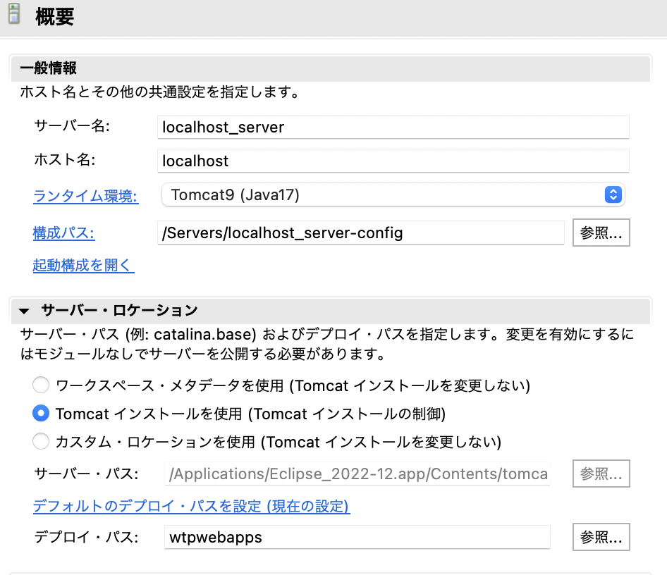

## サーブレットプロジェクト作成

- 右クリック→新規→その他
- Web→動的Webプロジェクトを選択→次へ
- プロジェクト名を入力
```
ex) CustomerManagement
パスカルケース( PascalCase )
```
-eb.xmlデプロイメントの記述子の生成にチェック

## プロジェクトをTomcatに設定
【サーバー】
右クリック　＞　サーバー

- Tomcat v9.0サーバを選択
- プロジェクトを追加

## ローカルサーバーにアクセス
```
http://localhost:8080/
http://localhost:8080/SampleEnv/LoginServlet
```

## ローカルサーバーにアクセスできない場合
- サーバーの設定を変更
- サーバーロケーション（Tomcatインストール使用）


- クリーンをする

## Servletの作成
- [サーブレット作成](./2_Servlet.md)