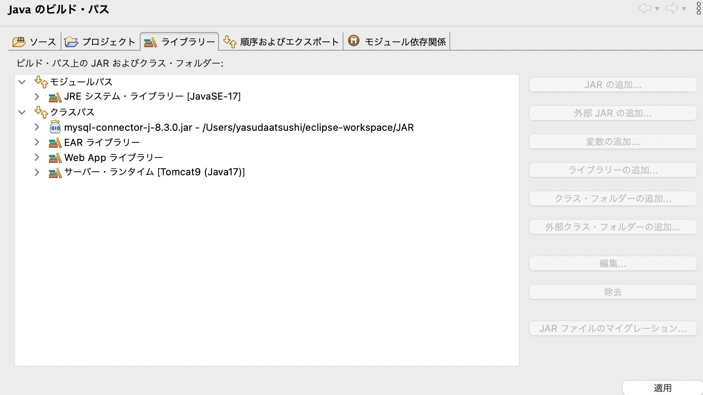

## JDBCのダウンロード
以下、MySQL用のJDBCをダウンロード
```
https://www.mysql.com/jp/products/connector/
```
- JDBC Driver for MySQL (Connector/J)をダウンロード

- 右クリック→ビルド・パス→ビルド・パスの構成
- ライブラリー → クラスパス → 外部JARの追加


### JDBCドライバが見つからないエラーでMYSQLが接続できない時
- ビルドパスに通していたJDBCドライバーを削除
- libフォルダにJDBCドライバーを配置

## JDBCドライバー
```
/JDBCドライバのロード
try{
	  Class.forName("com.mysql.cj.jdbc.Driver");
    } catch (ClassNotFoundException e){
      throw new IllegalStateException("失敗しました。");
 }
```


## MySqlの操作
-データベースの確認
```
show databases;
```

‐ データベース作成
```
create database customer_management_db;
create database [データベース名]
```

- データベースにアクセス
```
use customer_management_db

use [データベース名]
```

- テーブルを作成
```
create table if not exists admin_tb (admin_id int(11) not null auto_increment, name varchar(20) not null, password varchar(20) not null, primary key (admin_id));

create table if not exists [テーブル名]()

if not exists はすでに同じ名前のテーブルが存在している場合はテーブルの作成を行わないようにする
```

‐ テーブルの定義を確認
```
desc admin_tb;

desc [テーブル名]
```

‐ データを作成
```
insert into admin_tb(name , password) values("管理者2" , "1234");

```

- データを確認
```
select * from admin_tb;

```